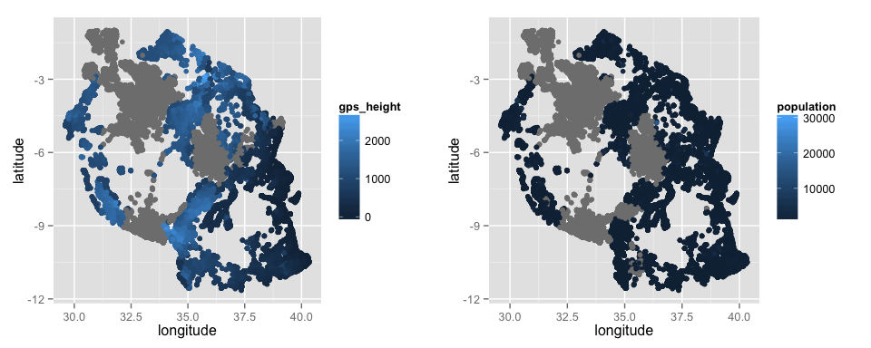

# Clean up existing predictors. Engineer some new features.


Load the data and a couple of functions to reduce the number of levels that a categorical variable takes.


```r
source("read-data.R")
```

```r
source("myRfunctions.R")
```

The data table contains an ID column, a subset indicator (`subset` is either *train* or *test*), a response column (`status_group` is *functional*, *functional needs repair* or *non functional*) and 38 features.


```r
##str(data) ## Use 'str' for more detailed information about the data
names(data) ## Or just print the column names
```

```
##  [1] "id"                    "status_group"         
##  [3] "amount_tsh"            "date_recorded"        
##  [5] "funder"                "gps_height"           
##  [7] "installer"             "longitude"            
##  [9] "latitude"              "wpt_name"             
## [11] "num_private"           "basin"                
## [13] "subvillage"            "region"               
## [15] "region_code"           "district_code"        
## [17] "lga"                   "ward"                 
## [19] "population"            "public_meeting"       
## [21] "scheme_management"     "scheme_name"          
## [23] "permit"                "construction_year"    
## [25] "extraction_type"       "extraction_type_group"
## [27] "extraction_type_class" "management"           
## [29] "management_group"      "payment"              
## [31] "payment_type"          "water_quality"        
## [33] "quality_group"         "quantity"             
## [35] "quantity_group"        "source"               
## [37] "source_type"           "source_class"         
## [39] "waterpoint_type"       "waterpoint_type_group"
## [41] "subset"
```

Based on their names alone, some features capture similar information but possibly at different granularity levels (e.g, `extraction_type` and `extraction_type_group`). For each grouping of features, I keep both the coarser and the finer variables but I group some of the smaller levels together so that categorical predictors have about a dosen or so levels.

### `extraction_type`, `extraction_type_group`, `extraction_type_class`


```r
data %>%
  group_by(extraction_type_class, extraction_type_group, extraction_type) %>% tally()
```

```
## Source: local data frame [18 x 4]
## Groups: extraction_type_class, extraction_type_group [?]
## 
##    extraction_type_class extraction_type_group           extraction_type
##                    (chr)                 (chr)                     (chr)
## 1                gravity               gravity                   gravity
## 2               handpump               afridev                   afridev
## 3               handpump         india mark ii             india mark ii
## 4               handpump        india mark iii            india mark iii
## 5               handpump           nira/tanira               nira/tanira
## 6               handpump        other handpump other - mkulima/shinyanga
## 7               handpump        other handpump         other - play pump
## 8               handpump        other handpump            other - swn 81
## 9               handpump        other handpump                    walimi
## 10              handpump                swn 80                    swn 80
## 11             motorpump                  mono                      mono
## 12             motorpump       other motorpump                      cemo
## 13             motorpump       other motorpump                    climax
## 14                 other                 other                     other
## 15             rope pump             rope pump         other - rope pump
## 16           submersible           submersible                       ksb
## 17           submersible           submersible               submersible
## 18          wind-powered          wind-powered                  windmill
## Variables not shown: n (int)
```

```r
data = data %>%
	mutate(extraction_type = revalue(extraction_type,
	                                 c("cemo" = "other motorpump",
	                                   "climax" = "other motorpump",
	                                   "other - mkulima/shinyanga" = "other handpump",
	                                   "other - play pump" = "other handpump",
	                                   "walimi" = "other handpump",
	                                   "other - swn 81" = "swn",
	                                   "swn 80" = "swn",
	                                   "india mark ii" = "india mark",
	                                   "india mark iii" = "india mark"))) %>%
	select( - extraction_type_group ) 
```

I remove the middle level `extraction_type_group` and combine some of the smaller levels, mostly by brand. For example, I combine *swn 80* and *swn 81* into *swn*.

### `management`, `management_group`


```r
data %>% group_by(management_group, management) %>% tally()
```

```
## Source: local data frame [12 x 3]
## Groups: management_group [?]
## 
##    management_group       management     n
##               (chr)            (chr) (int)
## 1        commercial          company   859
## 2        commercial private operator  2504
## 3        commercial            trust   105
## 4        commercial  water authority  1123
## 5             other            other  1083
## 6             other   other - school   126
## 7        parastatal       parastatal  2229
## 8        user-group              vwc 50624
## 9        user-group      water board  3688
## 10       user-group              wua  3118
## 11       user-group              wug  8108
## 12               NA               NA   683
```

I keep both `management` and `management_group` unmodified.

### `scheme_management`, `scheme_name`


```r
data %>% group_by(scheme_management, scheme_name) %>% tally()
```

```
## Source: local data frame [3,289 x 3]
## Groups: scheme_management [?]
## 
##    scheme_management               scheme_name     n
##                (chr)                     (chr) (int)
## 1            company             bagamoyo wate   348
## 2            company                      bffs     1
## 3            company                  borehole     1
## 4            company borehole drilling project     1
## 5            company       bsf water supplying     1
## 6            company      bulamba piped scheme     3
## 7            company      burieni water supply     1
## 8            company          doe water supply     4
## 9            company      ektm 2 water  supply     1
## 10           company        ektm 2 water suply    28
## ..               ...                       ...   ...
```

```r
data = data %>% select( - scheme_name)
```

I remove `scheme name` as it has too many levels, often with one or handful of examples.

### `payment`, `payment_type`


```r
data %>% group_by(payment_type, payment) %>% tally()
```

```
## Source: local data frame [7 x 3]
## Groups: payment_type [?]
## 
##   payment_type               payment     n
##          (chr)                 (chr) (int)
## 1     annually          pay annually  4570
## 2      monthly           pay monthly 10397
## 3    never pay             never pay 31712
## 4   on failure pay when scheme fails  4842
## 5        other                 other  1314
## 6   per bucket        pay per bucket 11266
## 7           NA                    NA 10149
```

```r
data = data %>% select( - payment )
```

Some categories are renamed but otherwise these features are exactly the same. I keep `payment_type`.

### `water_quality`, `quality_group`


```r
data %>% group_by(quality_group, water_quality) %>% tally()
```

```
## Source: local data frame [8 x 3]
## Groups: quality_group [?]
## 
##   quality_group      water_quality     n
##           (chr)              (chr) (int)
## 1       colored           coloured   623
## 2      fluoride           fluoride   244
## 3      fluoride fluoride abandoned    23
## 4          good               soft 63505
## 5         milky              milky  1005
## 6         salty              salty  6082
## 7         salty    salty abandoned   423
## 8            NA                 NA  2345
```

```r
data = data %>% select( - quality_group)
```

I keep the more precise factor `water_quality`.

### `quantity`, `quantity_group`


```r
data %>% group_by(quantity_group, quantity) %>% tally()
```

```
## Source: local data frame [5 x 3]
## Groups: quantity_group [?]
## 
##   quantity_group     quantity     n
##            (chr)        (chr) (int)
## 1            dry          dry  7782
## 2         enough       enough 41522
## 3   insufficient insufficient 18896
## 4       seasonal     seasonal  5075
## 5             NA           NA   975
```

```r
data = data %>% select( - quantity_group)
```

These features are exactly the same. I keep `quantity`.

### `source`, `source_type`, `source_class`


```r
data %>% group_by(source_class, source_type, source) %>% tally()
```

```
## Source: local data frame [10 x 4]
## Groups: source_class, source_type [?]
## 
##    source_class          source_type               source     n
##           (chr)                (chr)                (chr) (int)
## 1   groundwater             borehole             hand dtw  1108
## 2   groundwater             borehole          machine dbh 13822
## 3   groundwater         shallow well         shallow well 21140
## 4   groundwater               spring               spring 21216
## 5       surface                  dam                  dam   840
## 6       surface rainwater harvesting rainwater harvesting  2863
## 7       surface           river/lake                 lake   950
## 8       surface           river/lake                river 11964
## 9            NA                other                other   261
## 10           NA                other                   NA    86
```

```r
data = data %>%
	mutate(source = revalue(source,c("other" = NA))) %>% select( - source_type)
```

I remove the middle level `source_type`. I am not sure if *other* means other or unknown, so I relabel *other* as NA.

### `waterpoint_type`, `waterpoint_type_group`


```r
data %>% group_by(waterpoint_type_group, waterpoint_type) %>% tally()
```

```
## Source: local data frame [7 x 3]
## Groups: waterpoint_type_group [?]
## 
##   waterpoint_type_group             waterpoint_type     n
##                   (chr)                       (chr) (int)
## 1         cattle trough               cattle trough   150
## 2    communal standpipe          communal standpipe 35628
## 3    communal standpipe communal standpipe multiple  7611
## 4                   dam                         dam     8
## 5             hand pump                   hand pump 21884
## 6       improved spring             improved spring   959
## 7                 other                       other  8010
```

```r
data = data %>% select( - waterpoint_type_group)
```

I keep the more precise factor `waterpoint_type`.

### Geographic information

Several variables seem to describe the location: `region`, `region_code`, `district_code`, `ward`, `subvillage`, `lga`, `longitude` and `latitude`. The same `district_code` appears in different regions, so I assume this variable indicates a smaller unit within each region.


```r
data %>% group_by(region, region_code, district_code) %>% tally()
```

```
## Source: local data frame [138 x 4]
## Groups: region, region_code [?]
## 
##           region region_code district_code     n
##            (chr)       (chr)         (chr) (int)
## 1         arusha           2             1   226
## 2         arusha           2             2  1460
## 3         arusha           2             3   143
## 4         arusha           2             5   245
## 5         arusha           2             6   391
## 6         arusha           2             7  1244
## 7         arusha          24            30   402
## 8  dar es salaam           7             1   121
## 9  dar es salaam           7             2   633
## 10 dar es salaam           7             3   266
## ..           ...         ...           ...   ...
```

I guess that, in increasing degree of precision, the geographic information is given by

* `region` (or `region_code`)
* `district_code` within `region`
* `ward` 
* `subvillage`
* `longitude`x`latitude`

I keep the region (as a categorical predictor) and latitude, longitude (as numerical predictors). However, before I remove the other variables, I use the district-within-region information to fill in a few missing longitude and latitude values. The input long/lat coordinates for some points are (0,0), which doesn't make sense as this location is not in Tanzania. But there are no missing values in the region and district columns, so I can substitute missing individual long/lat values with their district *mean* long/lat.


```r
## Compute averages in districts within regions
data = data %>% 
  group_by(region,district_code) %>%
  mutate(district.long = mean(longitude, na.rm = TRUE)) %>%
  mutate(district.lat = mean(latitude, na.rm = TRUE)) %>%
  ungroup()
## Compute averages in regions (just in case the above is also NA)
data = data %>%
  group_by(region) %>%
  mutate(region.long = mean(longitude, na.rm = TRUE)) %>%
  mutate(region.lat = mean(latitude, na.rm = TRUE)) %>%
  ungroup()
## "Impute" missing longitude/latitude values
data = data %>%
  mutate(longitude = ifelse(!is.na(longitude), longitude,
                            ifelse(!is.na(district.long), district.long, region.long))) %>%
  mutate(latitude = ifelse(!is.na(latitude), latitude,
                           ifelse(!is.na(district.lat), district.lat, region.lat)))
```

```r
data = data %>% select( - region_code, - district_code,
                        - region.long, - region.lat,
                        - district.long, - district.lat,
                        - ward , - subvillage)
```

Finally, `lga` (local geographic area?) is interesting because there are distinct areas (e.g. *arusha*) but some of them are split into rural and urban (e.g., *arusha rural* and *arusha urban*). I transform this variable into a new feature that takes three values: rural, urban and other.


```r
data = data %>% mutate(lga = ifelse( grepl(" rural", lga), "rural",
                                     ifelse( grepl(" urban", lga), "urban","other")))
```

### Non-random missingness by region

There is also information about the number of people who use the pump, `population`. Since `gps_height` has a strong spatial component, it might be related to the elevation above sea level? Both features have more than 30% missing values, and moreover, these are not missing at random. (So I do not attempt to impute them.)


```r
p1 = ggplot(data, aes(x = longitude, y = latitude, color = gps_height)) + geom_point()
p2 = ggplot(data, aes(x = longitude, y = latitude, color = population)) + geom_point()
multiplot(p1, p2, cols=2)
```

 

### Day/Month/Year/Time information

There is some interesting time information as well: `date_recorded` and `construction_year`. Unfortunately, the year of construction is missing for about 35% of the data points. I convert it to `operation_years` by subtracting the year in which the status was recorded. There are a few negative years of operation! I set those to missing, as a clerical error might have occurred.


```r
data = data %>% mutate(date_recorded = ymd(date_recorded)) %>%
  mutate(operation_years = lubridate::year(date_recorded) - construction_year) %>%
  mutate(operation_years = ifelse(operation_years < 0, NA, operation_years))
```

I wonder if some pumps are more likely to not function during some seasons than others. From [Expert Africa](https://www.expertafrica.com/tanzania/info/tanzania-weather-and-climate): *Tanzania has two rainy seasons: The short rains from late-October to late-December, a.k.a. the Mango Rains, and the long rains from March to May.*

So I create a season variable. If there is a seasonal effect, it might be even better to include the recorded day of the year as an integer from 1 to 365. (Another alternative is the recorded month, either as a numerical or a categorical variable.)


```r
data = data %>%
  mutate(day_of_year = yday(date_recorded)) %>%
  mutate(month_recorded = lubridate::month(date_recorded)) %>%
  mutate(season = ifelse( month_recorded <= 2, "dry short",
                          ifelse( month_recorded <= 5, "wet long",
                                  ifelse(month_recorded <= 9, "dry long", "wet short")))) %>%
  select( - date_recorded, - month_recorded, - construction_year)
```

I keep the categorical `season` and the numerical `day_of_year`.

### Other categorical variables

There are three more categorical variables, with numerous distinct levels.


```r
cbind(
  data %>% group_by(funder) %>% tally() %>% arrange(desc(n)) %>% slice(1:10),
  data %>% group_by(installer) %>% tally() %>% arrange(desc(n)) %>% slice(1:10),
  data %>% group_by(wpt_name) %>% tally() %>% arrange(desc(n)) %>% slice(1:10)
)
```

```
##                    funder     n          installer     n        wpt_name
## 1  government of tanzania 11299                dwe 21756            none
## 2                    <NA>  5489               <NA>  5517         shuleni
## 3                  danida  3907         government  2367        zahanati
## 4                  hesawa  2782             hesawa  1768       msikitini
## 5                   rwssp  1703                rwe  1498        kanisani
## 6              world bank  1701              commu  1354          sokoni
## 7                    kkkt  1623             danida  1306         bombani
## 8            world vision  1562   district council  1181         ofisini
## 9                  unicef  1324               kkkt  1135          school
## 10                  tasaf  1136 central government   933 shule ya msingi
##       n
## 1  4442
## 2  2183
## 3  1034
## 4   647
## 5   390
## 6   328
## 7   323
## 8   321
## 9   260
## 10  247
```

Of these `funder` and `installer` have a few large categories (more than 500 instances), so I keep those and group their smaller categories under *other*. I remove `wpt_name` since I am not even sure what this is.


```r
data = data %>% select( - wpt_name) %>%
  mutate(funder = myreduce.levels(funder)) %>%
  mutate(installer = myreduce.levels(installer)) 
```

Finally, `num_private` is mostly 1s; there is only one instance with management == "none" and it is in the training data.


```r
data = data %>% select( - id , - num_private ) %>%
  filter(scheme_management != "none" | is.na(scheme_management))
```

### Missingness

Which features have a lot of missing values?


```r
mean.na = function(x) {	mean(is.na(x)) }
t(data %>% summarise_each(funs(mean.na)))
```

```
##                              [,1]
## status_group          0.200002694
## amount_tsh            0.701006074
## funder                0.073913453
## gps_height            0.345445730
## installer             0.074290563
## longitude             0.000000000
## latitude              0.000000000
## basin                 0.000000000
## region                0.000000000
## lga                   0.000000000
## population            0.361405541
## public_meeting        0.055960350
## scheme_management     0.065266872
## permit                0.051084863
## extraction_type       0.000000000
## extraction_type_class 0.000000000
## management            0.009198777
## management_group      0.009198777
## payment_type          0.136688710
## water_quality         0.031582917
## quantity              0.013131490
## source                0.004673464
## source_class          0.004673464
## waterpoint_type       0.000000000
## subset                0.000000000
## operation_years       0.349917171
## day_of_year           0.000000000
## season                0.000000000
```

I exclude `amount_tsh` because about 70% of the values are missing.


```r
data = data %>% select( - amount_tsh)
```


